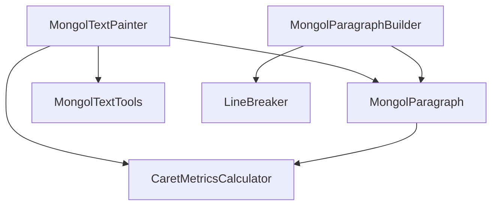

# 蒙古文核心排版引擎 (lib/src/base)

## 概述

`lib/src/base` 是本项目的核心引擎层，负责将富文本内容转换为可测量、可绘制、可编辑的垂直蒙古文布局。

它是整个库的“发动机”，不直接处理 Widget 交互，而是为上层组件（如 `MongolText`、`MongolEditableText`）提供高性能的底层能力。

## 核心设计策略：旋转引擎

本库采用了一种**高效的旋转策略**：
1.  **内部排版**：在排版计算阶段，将蒙古文视为从左到右的水平文本进行处理。
2.  **画布变换**：在绘制阶段，通过 Canvas 的 `rotate(pi/2)` 和 `translate` 变换，将计算出的“行”变为“竖列”。
3.  **片段处理**：通过 `LineBreaker` 识别非旋转片段（如西文字符）和旋转片段（如 CJK/Emoji），确保字符方向在垂直模式下符合排版习惯。

## 特性

- ✅ **原生垂直思维**：将垂直方向作为一等公民，支持从上到下、多列从左到右的完整排版。
- ✅ **段落级控制**：支持两端对齐（Justify）、最大行数限制和省略号处理。
- ✅ **非线性缩放**：完全支持 `TextScaler` 动态调整字体大小。
- ✅ **高性能缓存**：`MongolTextPainter` 内置布局缓存（`_layoutCache`），仅在必要时重新换行。
- ✅ **编辑安全度量**：提供精确的光标（Caret）位置计算，支持代理对、ZWJ 和 Unicode 方向控制字符。

## 架构流程

核心流程（从输入到绘制）如下：

1.  **输入接收**：上层传入 `TextSpan` 树和排版参数（如 `maxLines`、`textAlign`）。
2.  **构建段落**：`MongolTextPainter` 调用 `MongolParagraphBuilder` 使用 `LineBreaker` 将文本切分为 `RotatableString` 片段。
3.  **核心排版**：`MongolParagraph` 在高度约束下执行 `_calculateLineBreaks`，完成换列、行指标计算。
4.  **坐标转换**：将内部的水平坐标映射为外部的垂直绘制坐标。
5.  **测量与绘制**：`MongolTextPainter` 基于缓存完成绘制、命中测试、光标定位及文本选择框（Boxes）测量。
6.  **辅助计算**：由 `CaretMetricsCalculator` 负责光标度量，`MongolTextTools` 提供安全导航工具。

## 组件关系图



## 文件说明

### 1. `mongol_paragraph.dart`
**职责**：底层的布局与绘制引擎。
- **MongolParagraph**：承担真实布局入口。负责换列逻辑（内部水平排版）、边界计算及最终绘制。
- **MongolParagraphBuilder**：样式栈管理。将输入文本拆分为最小绘制单元（`_TextRun`）。
- **MongolLineMetrics**：行指标，描述 Ascent、Descent、Baseline、Width 等核心数据。

### 2. `mongol_text_painter.dart`
**职责**：高层协调器，也是上层调用最多的核心入口。
- 负责管理布局缓存，处理对齐因子（`textAlignment`）产生的偏移。
- 暴露直观的测量接口（高度、宽度、光标位置、选择矩形）。
- 处理文本样式的变化对比（`RenderComparison`），决定是重排布局还是仅重绘。

### 3. `mongol_text_metrics.dart`
**职责**：处理复杂的编辑态光标度量。
- 针对 `upstream` 和 `downstream` 亲和力（Affinity）做差异化处理。
- 确保光标在代理对或特殊字符处具有正确的宽度和对齐。

### 4. `mongol_text_tools.dart`
**职责**：文本处理工具集。
- **UTF-16 安全**：代理对识别、高低位转换。
- **坐标变换**：`shiftLineMetrics` 和 `shiftTextBox` 用于将段落内部坐标平移到对齐后的外部绘制坐标。
- **导航保护**：获取偏移量前后合法的光标位置。

### 5. `mongol_text_align.dart`
**职责**：定义垂直对齐语义。
- 定义 `top`、`bottom`、`center`、`justify` 四种垂直对齐枚举。

## API 调用建议

对于上层开发者，推荐始终优先使用 `MongolTextPainter`：

```dart
final painter = MongolTextPainter(
  text: TextSpan(text: 'ᠮᠣᠩᠭᠣᠯ'),
  textAlign: MongolTextAlign.center,
  textScaler: MediaQuery.textScalerOf(context),
);

// 执行布局
painter.layout(minHeight: 0, maxHeight: 200);

// 在 Canvas 上绘制
painter.paint(canvas, Offset.zero);

// 获取光标位置
final caretOffset = painter.getOffsetForCaret(TextPosition(offset: 0), Rect.zero);
```

## 维护建议

- **坐标一致性**：在修改 `MongolParagraph` 或 `MongolTextPainter` 的绘制逻辑时，务必同步更新 `MongolTextTools` 中的偏移转换函数。
- **缓存有效性**：任何影响文本换行的属性（如字体、缩放、最大行数）必须调用 `markNeedsLayout` 以使缓存失效。
- **代理对支持**：对文本遍历时，优先使用 `codeUnitAt` 配合 `MongolTextTools` 的验证函数，以确保表情符号等补充字符的排版正确。
